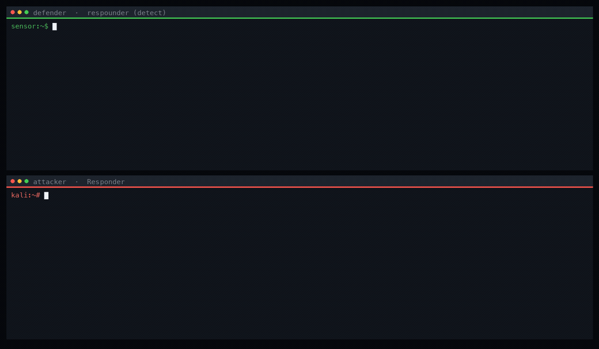
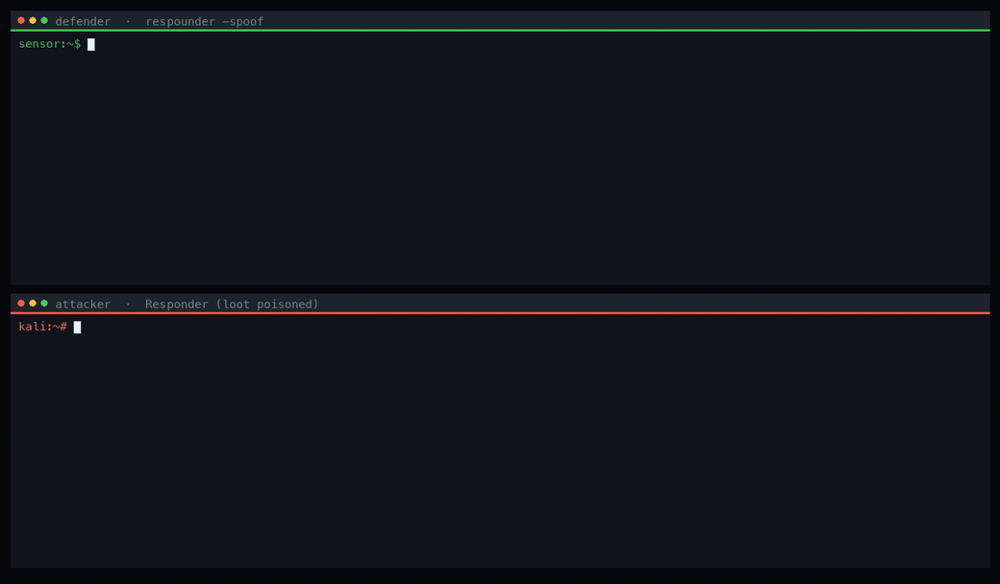
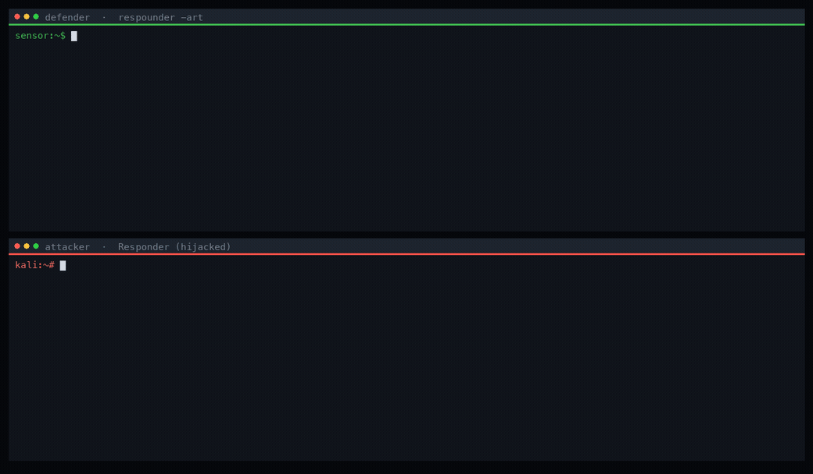

# Respounder

🇬🇧 **English** · [🇫🇷 Français](README.fr.md)

**Respounder** is a defensive **LLMNR / mDNS** scanner (a network *honeypot*). It
repeatedly queries the local network for hostnames that **do not exist**. On a
healthy network nobody answers. If a reply comes back, a *poisoner* — typically
[Responder](https://github.com/lgandx/Responder) — is active and is spoofing
those names to capture NTLM authentications.

> Go rewrite/extension of the original
> [`codeexpress/respounder`](https://github.com/codeexpress/respounder) — see
> [Credits](#credits). Adds **mDNS** detection, **multi-interface** scanning,
> **continuous** monitoring and a **counter-deception** mode (`-spoof`).

## Demos (use cases)

> Real captures from the Docker lab ([`lab/`](lab/)) — defender terminal on top,
> attacker terminal (Responder) below.

**1. Detection — unmask a poisoner**
respounder queries fictitious hostnames; any reply gives Responder away as it
poisons, thinking it is trapping victims.



**2. Counter-poisoning (`-spoof`) — drown the loot**
Once the attacker is spotted, respounder sends it dozens of fake victims with
varied source IPs: its capture logs become useless.



**3. Deception (`-art`) — a Machiavelli cat in the attacker's terminal**
respounder injects escape sequences into the queried name: the attacker's screen
is cleared and an ASCII cat reciting Machiavelli is animated on it.



## Purpose

LLMNR/NBT-NS/mDNS poisoning is one of the first techniques used during an
intrusion on a Windows domain. Respounder serves two needs:

- **Detect** continuously the presence of such an attacker on the network: every
  `[RESPONDER DETECTED]` flags an ongoing poisoning, since the queried names are
  fictitious.
- **Decoy and counter-poison** (`-spoof`): once the attacker is spotted,
  Respounder emits queries with **spoofed source IPs** and realistic machine
  names. The attacker's Responder thinks it sees dozens of nonexistent victims
  pouring in, and its loot drowns under unusable fake entries.

## How it works

1. Each cycle (`-interval`), an LLMNR and/or mDNS query is sent on every
   interface for one or more hostnames.
2. Any reply received is reported as `[RESPONDER DETECTED]` (since the queried
   name does not exist, only a malicious machine can answer).
3. If `-spoof N` is enabled, `N` spoofed-source probes are sent once per detected
   responder to poison its loot.

## Build

```bash
go build -o respounder .
```

## Usage

```bash
# Simple detection on all interfaces (no privilege needed)
./respounder

# Target a specific interface and hostname
./respounder -interface eth0 -hostname Administrator

# Realistic random hostnames, attached to a domain
./respounder -random -domain corp.local

# LLMNR only, 10s cycle, verbose mode
./respounder -protocol llmnr -interval 10s -v

# Counter-poisoning: 5 fake victims per detected responder (root required)
sudo ./respounder -random -domain corp.local -spoof 5 -interval 10s
```

### Options

| Flag | Description | Default |
|------|-------------|---------|
| `-hostname` | Hostname(s) to query, comma-separated | `Administrator` |
| `-random` | Generate realistic random hostnames | `false` |
| `-domain` | Domain appended to the hostname (e.g. `corp.local`) | — |
| `-interface` | Network interface(s), comma-separated | all |
| `-ip` | Source IP address to use | auto |
| `-protocol` | Protocol: `llmnr`, `mdns` or `both` | `both` |
| `-interval` | Interval between two scans | `30s` |
| `-spoof` | Number of spoofed-source probes per detected responder (**root**) | `0` |
| `-art` | Active deception: animate a Machiavelli-quoting cat into a watching poisoner's terminal | `false` |
| `-v` | Verbose mode (show probes sent) | `false` |
| `-debug` | Trace log file | — |

## Demo lab (Docker)

The [`lab/`](lab/) folder spins up a **two isolated hosts** lab on a dedicated
bridge network: an *attacker* running **Responder** and a *sensor* running
**respounder**.

```bash
cd lab
docker compose up --build      # the sensor prints [RESPONDER DETECTED]
docker compose down -v         # tear down
```

### 1. Defender side — `respounder` unmasks the attacker

```text
━━━━━━━━━━━━━━━━━━━━━━━━━━━━━━━━━━━━━━━━━━━━━━━━━━━━━━
Let's poison the poisoner — bottoms up.
━━━━━━━━━━━━━━━━━━━━━━━━━━━━━━━━━━━━━━━━━━━━━━━━━━━━━━
Query: Administrator (random mode)
Interval: 5s
Interfaces: 1
   > [eth0] 192.168.166.3
━━━━━━━━━━━━━━━━━━━━━━━━━━━━━━━━━━━━━━━━━━━━━━━━━━━━━━

[RESPONDER DETECTED] 192.168.166.2 | From [eth0] 192.168.166.3 | Protocol: LLMNR | Query: DESKTOP-PP7Q6
[RESPONDER DETECTED] 192.168.166.2 | From [eth0] 192.168.166.3 | Protocol: mDNS  | Query: DESKTOP-PP7Q6.local
[RESPONDER DETECTED] 192.168.166.2 | From [eth0] 192.168.166.3 | Protocol: LLMNR | Query: ERP-GMEKTV
[RESPONDER DETECTED] 192.168.166.2 | From [eth0] 192.168.166.3 | Protocol: mDNS  | Query: ERP-GMEKTV.local
[RESPONDER DETECTED] 192.168.166.2 | From [eth0] 192.168.166.3 | Protocol: LLMNR | Query: SRV-ALCCI
[RESPONDER DETECTED] 192.168.166.2 | From [eth0] 192.168.166.3 | Protocol: mDNS  | Query: SRV-ALCCI.local
```

### 2. Attacker side — Responder takes the bait

```text
[*] [LLMNR]  Poisoned answer sent to 192.168.166.3 for name DESKTOP-PP7Q6
[*] [MDNS]   Poisoned answer sent to 192.168.166.3 for name DESKTOP-PP7Q6.local
[*] [LLMNR]  Poisoned answer sent to 192.168.166.3 for name ERP-GMEKTV
[*] [MDNS]   Poisoned answer sent to 192.168.166.3 for name ERP-GMEKTV.local
```

### 3. Counter-poisoning (`-spoof`) — drowning the attacker's loot

With `-spoof 5`, Responder sees **fake victims with varied IPs** pouring in
(`.86`, `.36`, `.111`, `.10`, `.243`, `.20`…). Its capture logs become useless:

```text
[*] [LLMNR]  Poisoned answer sent to 192.168.166.86  for name ADMIN-KY2HCO.corp.local
[*] [MDNS]   Poisoned answer sent to 192.168.166.36  for name SRV-VL8BN.local
[*] [MDNS]   Poisoned answer sent to 192.168.166.111 for name USER-LEU9FI.local
[*] [LLMNR]  Poisoned answer sent to 192.168.166.10  for name DEV-6PXAM.corp.local
[*] [MDNS]   Poisoned answer sent to 192.168.166.243 for name ADMIN-EBOWQA.local
[*] [LLMNR]  Poisoned answer sent to 192.168.166.20  for name LAPTOP-99R4W.corp.local
```

### 4. Deception `-art` — a Machiavelli-quoting cat in the attacker's terminal

A poisoner **displays the queried name**. `-art` slips ANSI escape sequences into
that name: the attacker's screen is cleared and an animated cat (3 looping
frames) reciting Machiavelli appears. One frame (an LLMNR label ≤ 255 bytes)
looks like:

```text
[*] [LLMNR]  Poisoned answer sent to 192.168.166.3 for name \033[2J\033[H\033[2;4H  /\_/\ \033[3;4H ( o.o )\033[4;4H  > ^ < \033[6;2H\033[1;33m« The end justifies the means. »\033[0m
```

Rendered in **their** terminal (the escapes clear the screen and position the cursor):

```text
   /\_/\
  ( o.o )
   > ^ <

 « The end justifies the means. »
```

```bash
respounder -art -interface eth0          # animation loop (no privilege required)
```

> Only affects an attacker **watching Responder live** in a terminal (the log
> file stores the raw bytes). Same defensive/authorized scope as `-spoof`.

## Under the hood — colors & terminal control

Everything relies on **ANSI escape sequences**: control bytes that the terminal
**interprets** instead of displaying. The escape character is `ESC` (`0x1b`,
written `\033` or `\x1b`).

### Colors (in respounder's own output)

An `ESC[<n>m` code (SGR) changes the attribute of the following text; `ESC[0m`
resets it.

| Sequence | Effect |
|---|---|
| `\033[1;36m` | bold cyan — titles / banner |
| `\033[1;35m` | magenta — labels (`Query:`, `Interval:`…) |
| `\033[1;32m` | green — values (IP, counters) |
| `\033[1;31m` | red — `[RESPONDER DETECTED]` alerts |
| `\033[0m` | reset |

```go
const colorTitle = "\033[1;36m"
const colorReset = "\033[0m"
fmt.Fprintf(os.Stderr, "%sLet's poison the poisoner%s\n", colorTitle, colorReset)
```

### Clearing & driving the attacker's terminal (`-art`)

A poisoner **displays the queried name**. On top of colors, we slip into that
name sequences that **clear the screen** and **move the cursor** — the attacker's
terminal executes them:

| Sequence | Effect |
|---|---|
| `\033[2J` | **clears the whole screen** (the "clean") |
| `\033[H` | cursor to top-left (`row 1, col 1`) |
| `\033[<r>;<c>H` | place the cursor at row `r`, column `c` (draw the cat line by line) |
| `\033[1;33m … \033[0m` | quote in bold yellow |

Each cat frame is forged by `buildArtName`:

```go
func buildArtName(frameIdx int, quote string) string {
    var b strings.Builder
    b.WriteString("\x1b[2J\x1b[H")                       // clear screen + cursor home
    for i, line := range catFrames[frameIdx] {
        fmt.Fprintf(&b, "\x1b[%d;4H%s", i+2, line)       // each cat line, positioned
    }
    fmt.Fprintf(&b, "\x1b[6;2H\x1b[1;33m« %s »\x1b[0m", quote) // quote in yellow
    return b.String()
}
```

**One LLMNR query per frame** → when Responder re-prints the name, the screen is
cleared then redrawn: the cat **animates**. Constraint: an LLMNR label encodes
its length on **one byte**, so each frame is **≤ 255 bytes** (enforced at build).

## Credits

- Original tool: **[`codeexpress/respounder`](https://github.com/codeexpress/respounder)**
  — the idea of detecting Responder by querying fictitious LLMNR names.
- Detected tool / lab target: **[`lgandx/Responder`](https://github.com/lgandx/Responder)**
  (Laurent Gaffié) — the reference LLMNR/NBT-NS/mDNS *poisoner*.
